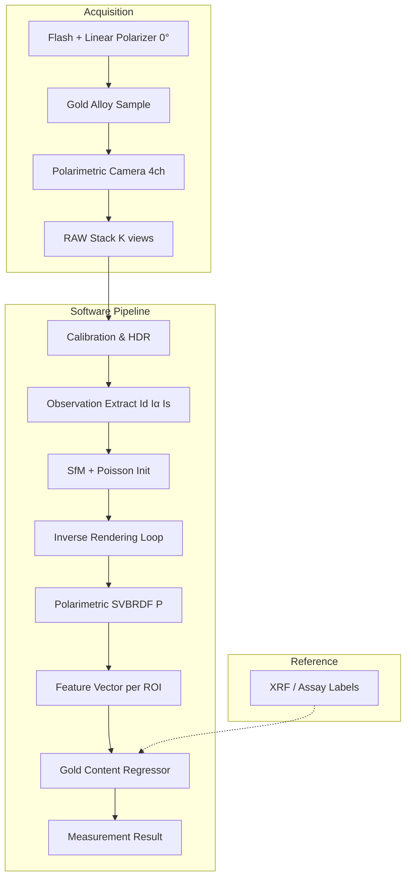

# Gold Sparse Ellipsometry — 시스템 스펙 (v0.1)


| 항목    | 내용                                                                                                                                                                                                   |
| ----- | ---------------------------------------------------------------------------------------------------------------------------------------------------------------------------------------------------- |
| 문서 ID | `GSE-SPEC-001`                                                                                                                                                                                       |
| 버전    | 0.1.0-draft                                                                                                                                                                                          |
| 기준 논문 | Hwang et al., *Sparse Ellipsometry: Portable Acquisition of Polarimetric SVBRDF and Shape with Unstructured Flash Photography*, SIGGRAPH 2022 ([arXiv:2207.04236](https://arxiv.org/abs/2207.04236)) |
| 참조 구현 | [KAIST-VCLAB/SparseEllipsometry](https://github.com/KAIST-VCLAB/SparseEllipsometry)                                                                                                                  |
| 목적    | 휴대형 편광 플래시 촬영(Sparse Ellipsometry)으로 금 합금 시편/주얼리 표면의 **광학·편광 특성**을 추정하고, 이를 **금 함량(순금 비율, K, wt%)**으로 환산하는 소프트웨어·하드웨어 시스템 정의                                                                         |


---

## 1. 개요

### 1.1 문제 정의

전통적 타원계(Ellipsometry)는 회전 광학부, 정밀 캘리브레이션, 수 일 단위 측정 시간이 필요하다. Sparse Ellipsometry는 **고정 편광부 + 편광 카메라 + 비구조화 플래시**로 20–30분 내 polarimetric SVBRDF와 3D 형상을 동시에 복원한다.

본 프로젝트는 동일 파이프라인을 **금 합금 함량 측정**에 특화한다.

- **입력**: 다시점 편광 RAW 이미지 세트, 캘리브레이션 데이터
- **중간 산출**: per-vertex 굴절률 η, diffuse/specular/single-scattering 파라미터, 법선, (선택) 메쉬
- **최종 산출**: 예측 금 함량 `gold_fraction`, 신뢰도, 측정 리포트

### 1.2 논문 대비 범위 조정 (필수 인지)


| 논문 가정                          | 본 프로젝트 대응                                            |
| ------------------------------ | ---------------------------------------------------- |
| **유전체(dielectric)** 표면, 선형 편광만 | 순금·합금은 **금속성** → Drude/복소 굴절률 n + ik 확장 필요 (Phase 2) |
| Mueller 3×3 (선형)               | Phase 1: 논문과 동일 3×3 근사 + **금속 보정 LUT**               |
| SVBRDF + 3D shape              | Phase 1: **평면/단일 시편** 위주; Phase 2: 곡면 주얼리            |
| 연구용 정확도 검증                     | Phase 1: **XRF/화학분석** 기준 라벨로 회귀 모델 학습                |


### 1.3 비목표 (Out of Scope, v0.1)

- X선 형광분광(XRF) 하드웨어 대체
- 법적 품질보증·인증서 발급
- 실시간(<1s) 라인 검사 (v0.1은 오프라인 배치)

### 1.4 성공 기준 (MVP)


| ID   | 기준                                                    |
| ---- | ----------------------------------------------------- |
| AC-1 | 24K/18K/14K 표준 시편 각 ≥10매에서 **K ±1.5K 이내** (교차검증 평균)   |
| AC-2 | 단일 시편 캡처+처리 **≤ 15분** (하드웨어 준비 제외)                    |
| AC-3 | 동일 시편 3회 반복 측정 **σ(K) ≤ 0.5K**                        |
| AC-4 | 산출 JSON 스키마(`measurement_result.schema.json`) 100% 준수 |


---

## 2. 시스템 아키텍처




### 2.1 모듈 경계


| 모듈 ID  | 이름                   | 책임                                                   |
| ------ | -------------------- | ---------------------------------------------------- |
| `acq`  | Acquisition Service  | 촬영 시퀀스, 플래시 강도 랜덤화, 메타데이터 기록                         |
| `cal`  | Calibration          | 카메라–플래시 각도(≈3.5°), Stokes→채널 행렬, radiometric         |
| `obs`  | Observation Builder  | I_d, I_\alpha, I_s per view (Eq. 16–18)              |
| `geo`  | Geometry             | COLMAP SfM, Poisson mesh, visibility                 |
| `pbr`  | Polarimetric Inverse | L_\psi, L_d, L_s, L_\phi 최적화 + specular augmentation |
| `gold` | Composition          | η·albedo·specular → K/wt% 회귀                         |
| `api`  | REST/CLI             | 잡 제출, 상태, 결과 조회                                      |


---

## 3. 하드웨어 스펙 (논문 §3.3 기반)

### 3.1 구성


| 부품     | 사양                                         | 허용 오차          |
| ------ | ------------------------------------------ | -------------- |
| 편광 카메라 | 4방향 선형 편광 필터: 0°, 45°, 90°, 135° (고정)      | 제조사 스펙         |
| 플래시    | 선형 편광 필터 **0°** 부착                         | —              |
| 기하     | 카메라 광축–플래시 **≈3.5°** (coaxial-near)        | 캘리브레이션 후 ±0.3° |
| 거리     | 시편–렌즈 working distance 고정                  | ±1 mm          |
| 조명     | 플래시 강도 프레임마다 **{1/4, 1/8, 1/16}** max 중 랜덤 | HDR 복원용        |


### 3.2 샘플 요구


| 항목  | 요구                                                       |
| --- | -------------------------------------------------------- |
| 표면  | 연마 평면 권장 (Ra ≤ 0.8 µm); 거친 표면은 `surface_roughness` 메타 필수 |
| 크기  | FOV 내 ≥ 70% 점유                                           |
| 오염  | 지문·오일 제거; 측정 전 10초 이상 안정화                                |
| 온도  | 20±3°C (굴절률 drift 최소화)                                   |


### 3.3 캘리브레이션 아티팩트

1. **Radiometric**: 그레이 카드 + 다중 플래시 강도 → HDR 곡선
2. **Geometric**: 알루미늄 구 또는 평면 타겟으로 카메라–플래시 baseline 각
3. **Polarimetric**: 알려진 η의 유리/다이얼로이드 참조판 (논문 검증용)
4. **Gold reference** (본 프로젝트): 24K, 22K, 18K, 14K, 10K 인증 시편 세트

캘리브레이션 결과는 `calibration_bundle.schema.json`으로 저장.

---

## 4. 데이터 모델

### 4.1 촬영 세션 (`capture_session`)

```yaml
session_id: uuid
created_at: ISO8601
device_id: string
sample:
  id: string
  material_label: string   # e.g. "Au-Cu 18K"
  nominal_karat: number    # optional prior
views:
  - view_index: int
    pose: { R: 3x3, t: 3 }  # world-from-camera, filled post-SfM
    flash_intensity: enum [quarter, eighth, sixteenth]
    raw_paths: [I0, I45, I90, I135]  # 16-bit RAW or DNG
```

스키마: `docs/schemas/capture_session.schema.json`

### 4.2 관측 이미지 (논문 §3.4)

각 뷰 k에서 4채널 Stokes 관측 \mathbf{I}^k = [I_0, I_{90}, I_{45}, I_{135}]^\top:


| 기호         | 정의               | 구현                       |
| ---------- | ---------------- | ------------------------ |
| I_d^k      | 2 I_{90}         | diffuse shading          |
| I_\alpha^k | I_{135} - I_{45} | diffuse polarization (α) |
| I_s^k      | I_0 - I_{90}     | specular-dominant        |


### 4.3 Polarimetric SVBRDF (per vertex)

논문 Eq. (4), (13) — near-coaxial 단순화 Mueller 근사:


\mathbf{P} \approx \begin{bmatrix}
\rho_d T^+ T^+ + \kappa_s R^+ + \kappa_{ss} R^+ & \cdots 
\vdots & \ddots
\end{bmatrix}


**최적화 변수 (vertex / cluster)**:


| 변수                     | 의미                              | 초기값          |
| ---------------------- | ------------------------------- | ------------ |
| \eta                   | 유효 굴절률 (Phase 1); Phase 2: n, k | 1.5          |
| \rho_d                 | diffuse albedo (RGB)            | cross-pol 평균 |
| \rho_s, \sigma_s       | specular albedo, roughness      | 클러스터 회귀      |
| \rho_{ss}, \sigma_{ss} | single scattering               | 클러스터 회귀      |
| \mathbf{n}             | shading normal                  | SfM normal   |


### 4.4 금 함량 특징 벡터 (본 프로젝트 확장)

ROI(또는 vertex cluster)마다:

```text
f = [ η_mean, η_std, ρ_d_R, ρ_d_G, ρ_d_B, ψ_mean, DoP_mean, κ_s_mean, surface_roughness_est ]
```

- \psi = |T^- / T^+|: 논문 Eq. (21) DoP 기반
- `surface_roughness_est`: specular lobe width proxy

**회귀 출력**:

```text
gold_fraction ∈ [0, 1]   # 순금 질량 분율
karat = 24 * gold_fraction
confidence ∈ [0, 1]
```

스키마: `docs/schemas/measurement_result.schema.json`

---

## 5. 소프트웨어 파이프라인

### 5.1 처리 단계


| Step | 입력             | 출력                               | 논문 절         |
| ---- | -------------- | -------------------------------- | ------------ |
| S0   | RAW            | demosaic, black level            | —            |
| S1   | 4ch            | HDR radiance \hat{L}             | §3.3 Debevec |
| S2   | HDR            | \mathbf{I}^k, I_d, I_\alpha, I_s | §3.4         |
| S3   | I_d multi-view | SfM point cloud, poses           | §4.2         |
| S4   | point cloud    | mesh X (Poisson 2^7→2^9)         | §4.2, §4.4   |
| S5   | loop           | optimize P, \mathbf{n}           | §4.3         |
| S6   | P, X           | update P from final geometry     | §4.4         |
| S7   | features       | `gold_fraction`, report          | **확장**       |


### 5.2 손실 함수 (논문 Eq. 19)


\min_{\eta, \sigma_s, \rho_s, \rho_{ss}, \rho_d, \mathbf{n}} 
\lambda_1 L_\psi + \lambda_2 L_d + \lambda_3 L_s + \lambda_4 L_\phi


| 항      | 가중치 (논문)        | 설명                               |
| ------ | --------------- | -------------------------------- |
| L_\psi | \lambda_1 = 1   | DoP vs η, θ (비선형 SQP)            |
| L_d    | \lambda_2 = 100 | diffuse I_d (선형)                 |
| L_s    | \lambda_3 = 1   | specular + augmentation (Eq. 24) |
| L_\phi | \lambda_4 = 100 | normal consistency               |


**Specular augmentation** (논문 §4.3):

- feature [\eta, \rho_d^R, \rho_d^G, \rho_d^B]로 K-means 클러스터
- 클러스터별 Eq. (25)로 \rho_s, \sigma_s, \rho_{ss}, \sigma_{ss} 회귀
- 가상 관측 M = 180, \lambda_g = 0.1

### 5.3 금 함량 회귀 (`gold` 모듈)

**Phase 1 — Gradient Boosting / Ridge on f**

- 학습: XRF 라벨이 있는 시편 N ≥ 50
- 검증: GroupKFold by `sample_id`
- 배포: ONNX 또는 pickle + 버전 핀

**Phase 2 — Metallic BRDF + spectroscopic prior**

- \eta \rightarrow (n, k) at λ≈550nm (가시 플래시 스펙트럼 대표)
- Drude–Lorentz prior for Au, Ag, Cu alloy

**불확실성**: conformal prediction 또는 bootstrap → `confidence`

### 5.4 의사코드 (메인 루프)

```python
def run_pipeline(session: CaptureSession) -> MeasurementResult:
    cal = load_calibration(session.device_id)
    views = [build_observations(demosaic_hdr(v), cal) for v in session.views]
    mesh, poses = initialize_geometry(views)  # SfM + Poisson
    P, N = init_svbrdf_from_cross_pol(views, mesh)
    for iter in range(MAX_ITERS):
        P, N = optimize_svbrdf_normals(P, N, views, mesh, lambdas=(1, 100, 1, 100))
        mesh = poisson_refine(N, mesh)
    P = refresh_svbrdf_from_geometry(P, mesh)
    roi = select_roi(mesh, session.sample)
  features = extract_gold_features(P, roi)
    return regressor.predict(features, cal_version=cal.version)
```

---

## 6. API 스펙

### 6.1 REST (v1)


| Method | Path                        | 설명                        |
| ------ | --------------------------- | ------------------------- |
| `POST` | `/v1/sessions`              | 촬영 세션 생성                  |
| `POST` | `/v1/sessions/{id}/views`   | 뷰 RAW 업로드 (multipart)     |
| `POST` | `/v1/sessions/{id}/process` | 파이프라인 비동기 실행              |
| `GET`  | `/v1/jobs/{job_id}`         | 상태: `queued               |
| `GET`  | `/v1/sessions/{id}/result`  | `measurement_result` JSON |


OpenAPI: `docs/api/openapi.yaml`

### 6.2 CLI

```bash
gse process --session ./data/session_001 --cal ./cal/device_A.json --out ./out/result.json
gse calibrate --device device_A --artifacts ./cal_targets/
```

---

## 7. 디렉터리 구조 (구현 대상)

```text
gold-sparse-ellipsometry/
├── docs/
│   ├── SPEC.md                 # 본 문서
│   ├── api/openapi.yaml
│   └── schemas/*.schema.json
├── src/
│   ├── acq/                    # 촬영 메타·시퀀스
│   ├── cal/
│   ├── obs/
│   ├── geo/                    # COLMAP 래퍼
│   ├── pbr/                    # 손실·최적화
│   ├── gold/                   # 회귀·리포트
│   └── api/
├── configs/
│   ├── pipeline_default.yaml
│   └── loss_weights.yaml
├── data/
│   ├── reference_samples/      # git-lfs, 인증 시편
│   └── calibrations/
└── tests/
    ├── test_observations.py    # Eq. 16–18 수치 검증
    └── test_schemas.py
```

---

## 8. 설정 (`configs/pipeline_default.yaml`)

```yaml
geometry:
  poisson_depth_init: 7
  poisson_depth_final: 9
optimization:
  max_iters: 20
  lambdas: { psi: 1, diffuse: 100, specular: 1, normal: 100 }
  specular_augmentation:
    M_virtual: 180
    lambda_g: 0.1
capture:
  min_views: 12
  recommended_views: 24
  flash_intensity_levels: [0.25, 0.125, 0.0625]
gold_regressor:
  model: gradient_boosting
  min_training_samples: 50
  target: karat
```

---

## 9. 테스트 계획


| ID  | 유형          | 내용                                             |
| --- | ----------- | ---------------------------------------------- |
| T-1 | Unit        | Stokes 채널 합성 → I_d, I_\alpha, I_s 역산 오차 < 1e-6 |
| T-2 | Unit        | JSON Schema validation for all I/O             |
| T-3 | Integration | 합성 렌더 이미지 → η 복원 오차 (유전체 참조)                   |
| T-4 | System      | 인증 시편 5종 × 3회 반복 → AC-1~AC-3                   |
| T-5 | Regression  | 모델 버전 업 시 golden result diff                   |


---

## 10. 리스크 및 완화


| 리스크              | 영향      | 완화                                    |
| ---------------- | ------- | ------------------------------------- |
| 금속 vs 유전체 모델 불일치 | K 오차 증가 | 금 전용 보정 데이터셋, Phase 2 복소 η            |
| 좁은 specular lobe | L_s 불안정 | 논문 augmentation + 더 많은 뷰              |
| 표면 오염/스크래치       | DoP 왜곡  | 품질 게이트, 재촬영 UX                        |
| 합금 원소 조합 미학습     | 외삽 실패   | `confidence` 하한 + "unknown alloy" 플래그 |


---

## 11. 마일스톤


| Phase | 기간(가이드) | 산출                               |
| ----- | ------- | -------------------------------- |
| P0    | 2주      | 본 스펙, 스키마, 합성 T-1                |
| P1    | 4주      | `obs`+`cal`+`geo` (논문 재현, 유리 참조) |
| P2    | 6주      | `pbr` 최적화 루프                     |
| P3    | 4주      | `gold` 회귀 + XRF 라벨 50+           |
| P4    | 2주      | API/CLI, 현장 파일럿                  |


---

## 12. 참고 문헌

1. Hwang, I. et al. (2022). Sparse Ellipsometry. ACM TOG 41(4), Article 133.
2. Baek, S.-H. et al. (2020). Image-Based Acquisition and Modeling of Polarimetric Reflectance. SIGGRAPH.
3. Baek, S.-H. et al. (2018). Simultaneous Acquisition of Polarimetric SVBRDF and Normals. TOG.
4. Alloy stoichiometry via neural-network ellipsometry (Optics Letters, 2023) — 함량 회귀 벤치마크 참고.

---

## 부록 A: 논문 관측식 ↔ 구현 매핑


| 논문 Eq.    | 구현 함수 (예정)                                 | 모듈    |
| --------- | ------------------------------------------ | ----- |
| (15)      | `stokes_from_channels(I0,I45,I90,I135)`    | `obs` |
| (16)      | `diffuse_obs(I)` → `Id`                    | `obs` |
| (17)      | `diffuse_pol_alpha(I)` → `Ialpha`          | `obs` |
| (18)      | `specular_dominant(I)` → `Is`              | `obs` |
| (19)–(24) | `PolarimetricSolver.step()`                | `pbr` |
| (21)      | `dop_from_observations(Id, Ialpha, Ibeta)` | `pbr` |


## 부록 B: 용어


| 용어                  | 정의                                 |
| ------------------- | ---------------------------------- |
| K (karat)           | 24 × 순금 질량 분율                      |
| SVBRDF              | Spatially-Varying BRDF             |
| DoP                 | Degree of Polarization             |
| Sparse Ellipsometry | 소수의 고정 편광 관측 + 다시점으로 full pBRDF 근사 |


---

*문서 변경 시 `version` 필드를 갱신하고, breaking change는 `measurement_result.schema.json`의 `schema_version`을 올린다.*